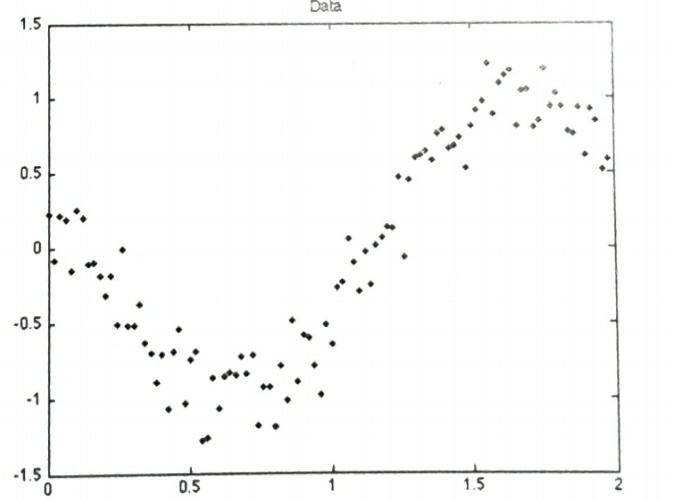
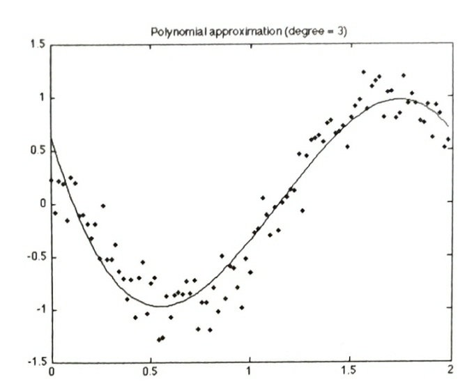
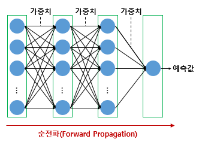

---

## 1) 몬테카를로, 살사, 큐러닝의 한계

-   몬테카를로, 살사, 큐러닝은 다이내믹 프로그래밍과 다르게 환경의 완벽한 정보가 없어도 학습이 가능했지만 계산의 복잡도, 차원의 저주는 해결하지 못했다.
-   상태의 수가 늘어나면 다이내믹 프로그래밍이 오히려 계산이 빠른 경우가 있습니다.

---

## 2) 근사함수

-   큐러닝은 상태가 적은 문제에만 적용 가능 이런 단점을 극복하기위해 매겨변수로 근사하여 단점을 극복함

### 2-1) 근사함수을 활용하여 가치함수의 매개변수화

-   많은 데이터가 있을 때 모든 정보를 저장하는 것 보다 어떠한 함수를 통해 근사를 하여 함수의 식을 가지는 것이 더 효율적이다.

-   어떠한 함수를 통해 근사한다는 것은 경향을 파악하는 것이다.
-   근사함수 중 인공신경망이 있습니다.

---

## 2) 인공신경망

### 2-1) 인공신경망 이란?

-   신경세포 즉 뉴런에서 영감을 받아 만든 수학적 모델
-   노드는 뉴런와 같은 역활
-   활성함수는 다른 노드에서 입력받은 값을 처리하는 함수를 뜻 합니다.

### 2-2) 활성함수

-   노드는 계층구조로 이루어져있습니다. 각 층은 레이어라고 부르고 층은 입력층, 은닉충, 출력층이 있습니다. 같은 층에 있는 노드들은 서로 연결되지 않는다는 특징이 있다.
-   기본 구조는 다른 층의 노드들끼리 서로 연결되어 있습니다.

-   이때 노드와 노드간의 연결에는 가중치가 있습니다. 가중치란 노드와 노드사이의 연결거리라고 할 수 있습니다.
-   활성함수의 입력되는 값은 아래와 같습니다.

$$활성함수의 입력 = \sum{(입력)}*{(가중치)}+bias$$

-   활성함수는 말그대로 함수입니다. 활성함수의 입력을 함수에 넣어 활성함수의 출력을 만듭니다. 이 뜻은 노드에 들어오는 값들을 다음 층에 바로 전달하지 않고 비선형 함수를 통과시켜 다른 노드로 전달 하는 것 입니다.
-   활성함수의 종류
    -   **Sigmoid Function (시그모이드 함수)**
    -   **RELU Function (렐루 함수)**
    -   **Tanh Functinon (하이퍼볼릭탄젠트 함수)**
    -   **leaky RELU Function (리키 렐루 함수)**
    -   등등

### 2-3) 딥러닝

-   딥러닝의 특징은 다양하고 복잡한 데이터에서 특징을 추출을 할 수 있습니다.
-   기존의 머신러닝 알고리즘은 전문가가 특징 추출을하고 그것을 학습에 데이터로 사용했습니다.
-   딥러닝은 각 노드는가 각자 다른 특징을 추출합니다. 즉 딥러닝은 여러 가지 복잡한 특징을 추출을 기존의 머신러닝 알고리즘과 다르게 스스로 추출 할 수 있습니다.

### 2-4) 딥러닝의 학습

-   딥러닝에서의 학습은 학습데이터와 정답을 활용해 가중치와 편향을 학습 하는 것 입니다.
-   출력층에서 나온 출력을 예측이라고 합니다.
-   이 예측을 정답과 계산해 예측을 점점 정답과 가깝게 가중치와 편향을 업데이트시키는 것을 반복하는것을 딥러닝에서의 학습이라고 합니다.
-   정답과 예측을 활용하여 오차를 계산하는 것을 오차함수라고 합니다.
-   오차함수의 종류
    -   **평균 제곱 오차 (Mean Squared Error, MSE)**
    -   **크로스 엔트로피 (Cross-Entropy)**
    -   **평균 제곱근 오차(Root Mean Square Error, RMSE)**
    -   등등
-   위에서 말한 가중치와 편향을 업데이트하는 방법 중 가장 중요한 알고리즘은 역전파 알고리즘입니다.

### 2-5) 역전파 알고리즘

-   역전파 알고리즘는 반대로 출력층에서 입력층 방향으로 편미분 계산을 통해 나온 기울기가 적은 방향 즉 오차를 줄이는 방향으로 가중치와 편향을 업데이트하는 알고리즘입니다. 기울가 적은 방향을 찾는 알고리즘 중 많이 사용하는 알고리즘은 경사하강법입니다.
-   경사하강법은 기울기를 구하여 기울기가 낮은 방향으로 이동시켜 극값에 이를 때까지 반복하는 것입니다.

---

## 3) 딥살사

-   그리드월드에 적용해보면 장애물이 움직이는 문제를 살사를 통하여 문제를 해결하기가 어렵습니다. 그러하여 나온 개념이 살사에 딥러닝 개념을 추가한 알고리즘인 딥살사입니다.
-   딥살사는 살사 알고리즘에 큐함수를 딥러닝과 비슷하게 근사하는 개념입니다. 살사와 다르점이 있습니다. 그것은 살사에서는 하나의 큐함수 값을 업데이트 했지만 딥살사는 그렇지 않습니다. 또한, 업데이트할 때는 경사하강법을 사용합니다.

$$Q(S_t,A_t)\leftarrow Q(S_t,A_t) + \alpha (R+\gamma Q(S_{t+1},A_{t+1})-Q(S_t,A_t))$$

-   경사하강법을 사용하여 업데이트하려면 오차함수가 있어야 합니다. 그러하여 보통 MSE를 사용합니다.

$$MSE = (정답 - 예측)^2$$

-   딥살사에서의 정답은 아래와 같은 값을 사용합니다.

$$R_{t+1} + \gamma Q(S_{t+1},a_{t+1})$$

-   딥살사에서의 예측은 아래와 같은값을 사용합니다.

$$Q(S_t,A_t)$$

-   그러햐여 오차 함수는 아래와 같습니다.

$$(R_{t+1} + \gamma Q(S_{t+1},a_{t+1})-Q(S_t,A_t))^2$$

-   가중치와 편향을 인공신경망을 활용하여 오차함수를 최소한이 되도록 업데이트를 합니다.
-   출력을 통해 나온 값은 큐함수 입니다. 또한 인공신경망을 사용하여 입력이 들어가면 각 행동에 대한 큐함수를 출력을 내놓습니다. 이는 근사된 값입니다.
-   딥살사의 행동은 인공신경망을 통해 나온 값 출력 중 즉 큐함수 중 가장 큰 값을 가지는 행동을 합니다.
-   딥살사에서 사용되는 $\epsilon$은 살사와 다르게 시간에 따라서 감소합니다. 그러한 이유는 초반에는 탐험을 통해 다양한 상황을 통해 학습을 하고 나중에는 예측하는대로 에이전트가 움직이기 위해서입니다.

---

## 4) 폴리시 그레이디언트

### 4-1) 정책기반 강화학습

-   언급된 살사와 딥살사는 가치 기반 강화학습입니다. 또 다른 방법으로 순차적 행동 결정하는 방법으로 정책 기반 강화학습이 있습니다.
-   정책 기반 학습은 가치 함수를 토대로 행동을 선택하지 않고 상태에 따라 행동을 선택합니다. 딥살사는 큐함수를 근사했지만 정책 기반 학습은 정책을 근사시킵니다.

### 4-2) 폴리시 그레이디언트

-   정책기반 강화학습은 누적 보상을 최대로 하는 최적 정책을 찾는 것입니다.
-   정책을 근사하는 인공신경망을 사용하는 경우에 정책신경망의 계수에 따라 에이전트가 받을 누적 보상이 달리집니다. 정책신경망의 계수가 목표로 하는 누적 보상이라는 함수의 변수이다.
-   정책신경망의 가중치값이 정책을 대체합니다. 위에서 설명드렸듯이 딥살사와는 다르게 오류함수를 최소하는 것이 아니라 목표함수를 최대화 하는 것입니다. 이는 경사상승법을 따른다. 정책을 아래와 같이 표현 할 수 있습니다.

$$정책=\pi_{\theta}(a|s)$$

-   가중치값은 목표함수의 미분값의 일부분을 더한 값이 업데이트 됩니다. $$J(\theta)$$는 목표함수이다.

$$\theta_{t+1} = \theta_{t}+ \alpha \nabla_{\theta}J(\theta)$$

-   위와 같이 목표함수의 경사상승법을 따라서 근사된 정책을 업데이트하는 방식을 포리시 그레이디언트라고 합니다.
-   논문 "Policy Gradient Methods for Reinforcement learning with Function Approximation"의 정리에 따르면 아래와 목표함수의 미분값을 아래와 같습니다. $$d_{\pi_{\theta}}$$는 s라는 상태에 에이전트가 있을 확률 입니다.

$$\nabla_{\theta}J(\theta)=\sum_{s}d_{\pi_{\theta}}(s)\sum_{a}\nabla_{\theta}\pi_{\theta}(a|s)q_{\pi}(s,a)$$

-   위의 식은 가능한 모든 상태에 대해 각 상태에서 특정 행동을 했을 때 받을 큐함수의 기댓값을 의미 이는 에이전트가 에피소드 동안 내릴 선택에 대한 좋고 나쁨의 지표가 됨
-   $$f(x)\nabla_{x}logf(x)=\nabla_{x}f(x)$이므로 $$\nabla_{\theta}\pi_{\theta}(a|s)$$을 치환하면

$$\nabla_{\theta}J(\theta)=\sum_{s}d_{\pi_{\theta}}(s)\sum_{a}\pi_{\theta}(a|s) * \nabla_{\theta}log\pi_{\theta}(a|s)q_{\pi}(s,a)$$

-   목표함수의 미분값을 기대값으로 표현하면 아래와 같다.

$$\nabla_{\theta}J(\theta)=E_{\pi_{\theta}}[\nabla_{\theta}log\pi_{\theta}(a|s)q_{\pi}(s,a)]$$

-   이를 다시 업데이트 식으로 바꾸면 아래와 같다.

$$\theta_{t+1}\approx\theta_{t}+\alpha[\nabla_{\theta}log\pi_{\theta}(a|s)q_{\pi}(s,a)]$$

-   그러면 우리가 구해야 할것은 $$\nabla_{\theta}log\pi_{\theta}(a|s)q_{\pi}(s,a)$$ 이다 하지만 폴리시 그레이디언트에서는 가치함수나 큐함수의 값을 가지고 있지 않기 때문에 큐함수를 $$G_{t}$$ 로 대체하는 것이다. 이것이 REINFORCE 알고리즘이다.

$$\theta_{t+1}\approx\theta_{t}+\alpha[\nabla_{\theta}log\pi_{\theta}(a|s)G_{t}]$$

-   REINFORCEMENT에서 가중치 업데이트 방식은 에피소드가 끝난 후 환경으로부터 받은 정보를 토대로 위 식을 통하여 가중치 업데이트가 진행된다.
-   또한 행동을 할 때에는 출력층에서 값이 나오는데 이것은 각각의 정책 확률이여서 $$\epsilon$$-탐욕정책을 사용하지 않더라도 탐험이 가능합니다.
-   REINFORCEMENT에서의 오류함수는 $$\nabla_{\theta}[log\pi_{\theta}(a\|s)G_{t}]$$가 오류함수이다.
